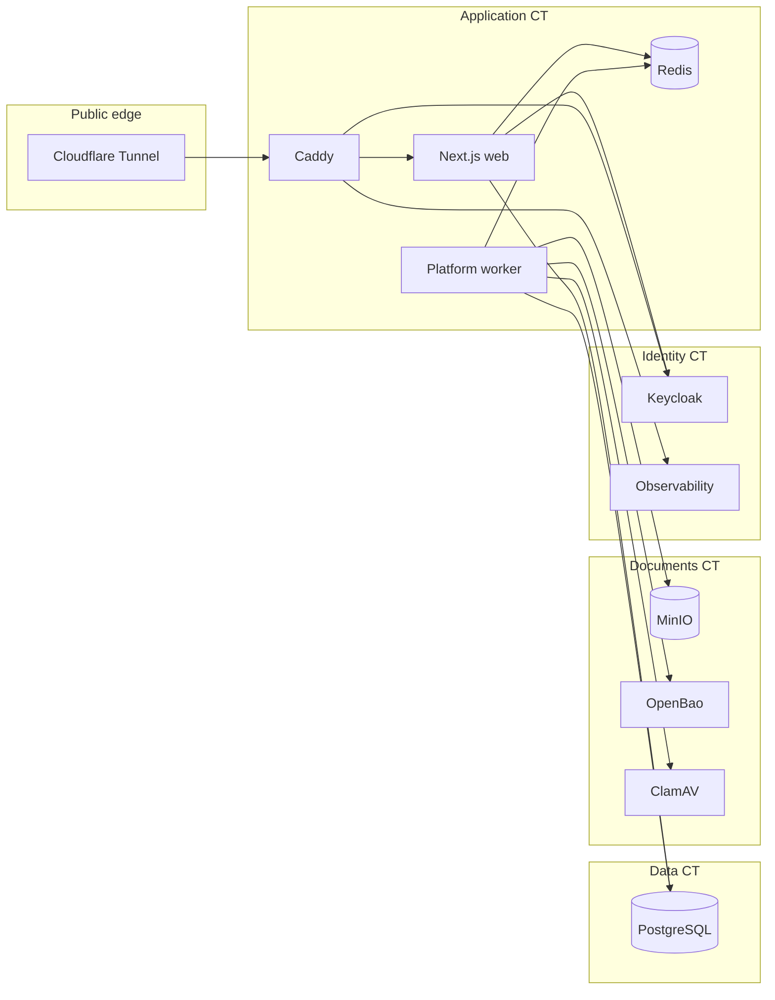

# Architecture

Local GTM is a multi-tenant legal CRM designed for private Proxmox deployment
with a public, portfolio-quality source repository.

## Planes

## Application boundaries

- **Presentation**: React components in `apps/web` remain presentation-only.
- **HTTP**: Route handlers authenticate, parse Zod input, and delegate to services.
- **Services**: Authorization, validation, transactions, RLS context, and audit
  writes live in `packages/db`.
- **Async work**: BullMQ/Redis queues carry durable identifiers only; PostgreSQL
  outbox records remain recoverable when workers are unavailable.
- **AI**: LM Studio runs on Windows localhost. Model output is validated and stored
  as advisory suggestions until a user approves a domain change.

## Tenancy and data safety

Every tenant-owned record includes `tenant_id`. Access always runs with the
authenticated membership's transaction-local tenant context and PostgreSQL RLS.

Financial ledger entries are immutable; corrections are linked reversals.
Documents remain quarantined until malware scanning completes.

## Repository vs production

The public repository contains templates and examples using placeholders such as
`crm.example.com` and `DATABASE_SERVER`. Production values remain on the deployment
hosts under `/etc/local-gtm/`.
