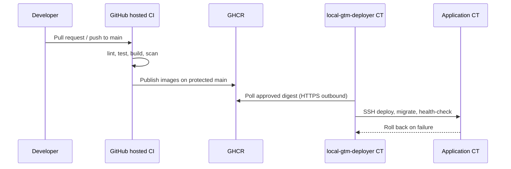

# Deployment model

Local GTM separates **public source control** from **private production deployment**.

## CI/CD overview



## GitHub-hosted CI

Runs exclusively on GitHub-hosted Ubuntu runners:

- formatting, lint, typecheck
- unit, integration, and e2e tests
- production build
- Docker image build verification
- dependency audit and review
- secret and filesystem scans

Pull-request jobs use read-only `contents` permissions and no repository secrets.

## Image publishing

After CI succeeds on protected `main`:

- images publish to `ghcr.io/<owner>/<repo>/web|<platform-worker>|migrator`
- tags include the full commit SHA and a moving `main` tag
- production should deploy by immutable digest, not the moving tag

Images do not embed runtime environment files, private addresses, or production data.

## Pull-based local deployment

The `local-gtm-deployer` CT:

- polls GHCR outbound over HTTPS
- compares candidate and approved digests
- acquires a deployment lock
- pulls exact digests
- runs migrations through a dedicated migrator image
- deploys application containers
- validates `/api/health/live`, `/ready`, and `/smoke`
- rolls back to the previous digest on failure

It does **not**:

- register a self-hosted GitHub runner
- expose an inbound deployment webhook
- store GitHub write credentials
- execute pull-request code

Templates live in [deploy/](../deploy/).

## Local production configuration

Production-only files remain outside Git:

| File                                          | Purpose                                    |
| --------------------------------------------- | ------------------------------------------ |
| `/etc/local-gtm/crm.env`                      | Application runtime environment            |
| `/etc/local-gtm/deployment.env`               | Deployer GHCR and SSH settings             |
| `/etc/local-gtm/hosts.env`                    | Private host placeholders resolved locally |
| `/var/lib/local-gtm-deployer/current-digest`  | Active deployment digest                   |
| `/var/lib/local-gtm-deployer/previous-digest` | Rollback target digest                     |

Recommended permissions:

- secret directories: `750`
- environment and key files: `600`

## Setting up the deployment CT

```bash
sudo useradd --system --create-home --home-dir /var/lib/local-gtm-deployer local-gtm-deploy
sudo mkdir -p /etc/local-gtm/deploy /var/lib/local-gtm-deployer/metadata
sudo cp deploy/config.example /etc/local-gtm/deployment.env
sudo cp deploy/config.example /etc/local-gtm/hosts.env
sudo install -m 750 deploy/poller.sh deploy/deploy.sh deploy/rollback.sh deploy/health-check.sh /opt/local-gtm/deploy/
sudo install -m 644 deploy/local-gtm-deployer.service deploy/local-gtm-deployer.timer /etc/systemd/system/
sudo systemctl daemon-reload
sudo systemctl enable --now local-gtm-deployer.timer
```

Replace every placeholder, install a dedicated deploy SSH key with known-host
pinning, and write the manually approved digest to
`/var/lib/local-gtm-deployer/approved-digest`.

## Rollback procedure

1. Confirm `/var/lib/local-gtm-deployer/previous-digest` contains the last good digest.
2. Run `/opt/local-gtm/deploy/rollback.sh`.
3. Verify public health endpoints through the tunnel.
4. Record the incident and keep the failed digest out of the approved list until
   the root cause is resolved.

Rollback restores the prior image digest only; it does not delete database or
object storage volumes.
